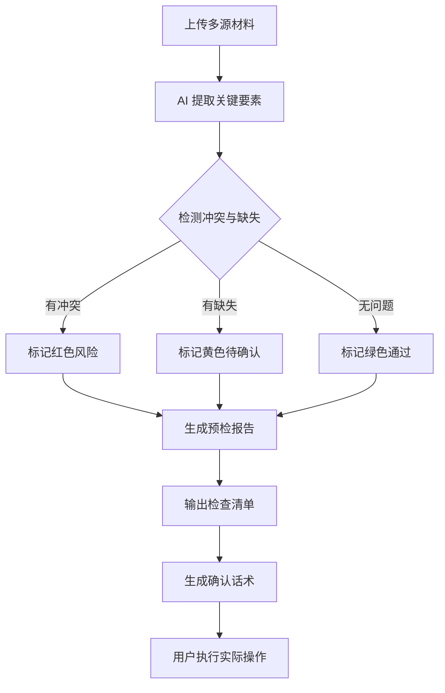

# 有据 PRD（产品需求文档）

## 1. 产品概述

**有据** 是一个 AI 网页工作台，帮助用户在关键动作前（报名、签约、提交、购买）将分散在聊天记录、截图、网页、文档、合同里的信息整合起来，自动找出冲突和缺失，给出风险提醒和检查结果。

### 核心价值
- **效率提升**：把分散在不同地方的信息快速整理，减少来回核对、重复阅读的时间
- **风险预检**：提前发现问题，如承诺未落进正式文本、要求与材料对不上、存在冲突或缺失

### 目标用户
学生、求职者、职场协作者，以及需要处理复杂要求、提交材料、确认规则的普通用户。

---

## 2. 核心功能模块

### 2.1 用户角色
| 角色 | 注册方式 | 核心权限 |
|------|---------|---------|
| 普通用户 | 邮箱/手机注册 | 上传材料、使用分析功能、查看报告 |

### 2.2 功能页面

1. **首页/Hero 页面**
   - 价值主张展示
   - 核心场景介绍
   - 工作台入口

2. **工作台页面（核心）**
   - 多源输入面板：支持聊天记录、截图、网页、文档、合同上传
   - AI 分析面板：显示风险点、冲突、缺失、检查清单
   - 风险总览：严重风险数、待确认项、已验证通过
   - 操作区：导出报告、生成确认话术

3. **场景切换**
   - 作业提交场景
   - 租房签约场景
   - 二手购买场景
   - 其他自定义场景

4. **报告输出**
   - 风险报告生成
   - 确认话术生成（一键复制）

---

## 3. 核心流程

### 用户主流程
```
用户上传材料 → AI 提取关键要素 → 跨源冲突检测 → 生成预检报告 → 用户确认/修改 → 执行实际操作
```

### Mermaid 流程图


---

## 4. 用户界面设计

### 4.1 设计风格
- **主题**：深色科技风格，突出专业感和信任感
- **主色调**：深蓝灰 `#070a13`，强调色 `#3b82f6`
- **辅助色**：
  - 成功/绿色 `#10b981`
  - 警告/黄色 `#f59e0b`
  - 危险/红色 `#ef4444`
- **字体**：Outfit（英文）+ Noto Sans SC（中文）
- **布局**：卡片式、双栏工作台、响应式设计

### 4.2 页面设计

| 页面 | 模块 | UI 元素 |
|------|------|--------|
| 首页 | Hero区域 | 渐变标题、价值主张、副功能入口 |
| 工作台 | 输入面板 | 拖拽上传、源类型图标、状态标签 |
| 工作台 | 分析面板 | 标签页切换、风险卡片、度量条 |
| 工作台 | 操作栏 | 紧急提示、操作按钮 |
| 场景展示 | 场景卡片 | 图标、标题、描述、场景特征 |

### 4.3 响应式设计
- Desktop-first，适配 1024px、768px 断点
- 移动端工作台改为单栏布局
- 触摸设备禁用自定义光标

### 4.4 交互动效
- 滚动触发动画（3D 透视入场）
- 鼠标跟随光晕效果
- 标签页切换过渡
- 滑块拖动对比
- 主题切换（明/暗）

---

## 5. 技术实现（当前 Demo）

### 前端技术
- 纯 HTML/CSS/JavaScript（单文件 demo）
- Google Fonts（Outfit + Noto Sans SC）
- CSS 自定义属性（主题变量）
- Intersection Observer（滚动动画）
- Clipboard API（复制功能）

### 核心功能实现
- 场景数据模拟（SCENARIOS 对象）
- 动态内容切换
- 滑块对比组件
- 模态框话术生成器

---

## 6. 后续扩展方向

- 多标签页管理（同时处理多个项目）
- 用户认证系统
- 真实 AI 后端对接（Claude/GPT API）
- 文件解析（PDF、Word、图片 OCR）
- 协作功能（多人共享检查结果）
- 报告导出（PDF 格式）
