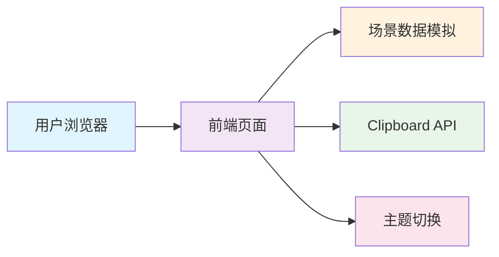
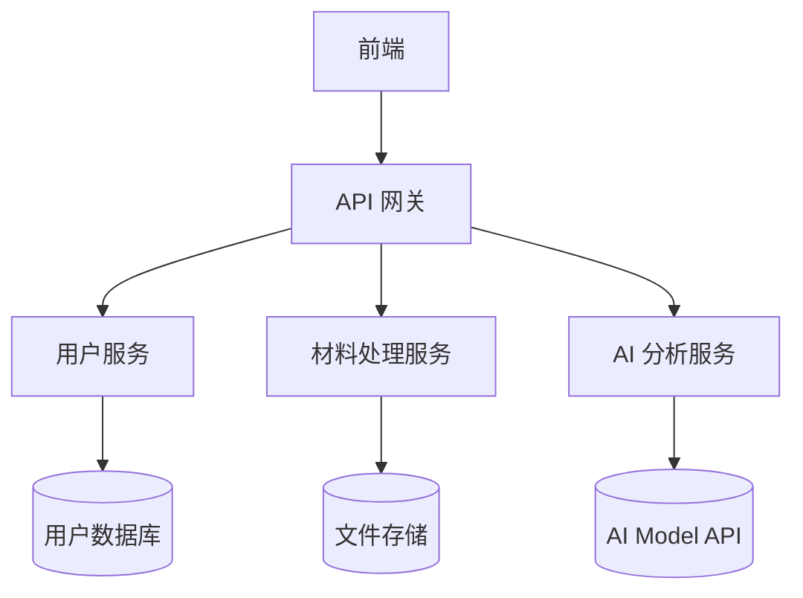

# 有据 技术架构文档

## 1. 架构设计



**当前 Demo 为纯前端单页应用，无需后端服务。**

---

## 2. 技术选型

### 前端技术栈
| 技术 | 版本/说明 | 用途 |
|------|----------|------|
| HTML5 | - | 页面结构 |
| CSS3 | - | 样式、动画、响应式 |
| JavaScript | ES6+ | 交互逻辑 |
| Google Fonts | Outfit + Noto Sans SC | 字体 |

### 关键 API/特性
- `IntersectionObserver`：滚动触发动画
- `Clipboard API`：复制话术功能
- `CSS Custom Properties`：主题切换
- `requestAnimationFrame`：光晕跟随动画

---

## 3. 路由定义

当前为单页面应用，无路由。

| 页面 | 功能 |
|------|------|
| index | 主展示页（Hero + 工作台 + 场景 + 价值主张） |

---

## 4. 核心数据结构

### SCENARIOS（场景数据）
```javascript
{
  homework: {
    statusText: String,      // 状态文本
    riskClass: String,       // 风险等级样式
    riskLabel: String,       // 风险标签
    metrics: {                // 度量数据
      align: Number,         // 版本一致度
      complete: Number,      // 信息完整度
      rule: Number          // 规则对齐度
    },
    sources: [               // 输入源列表
      { tag, title, desc, type }
    ],
    aligned: [              // 对齐结果
      { id, dot, label, sources, content, linkSrcs }
    ],
    todos: [                // 待办事项
      { text, btn, draftIdx }
    ]
  }
}
```

### DRAFT_TEMPLATES（话术模板）
```javascript
{
  title: String,     // 话术标题
  desc: String,      // 使用说明
  text: String       // 话术内容
}
```

---

## 5. 组件清单

| 组件 | 功能 | 状态 |
|------|------|------|
| Navbar | 导航栏 | 固定悬浮、主题切换 |
| Hero | 首屏区域 | 动画入场、文字渐变 |
| SandboxGrid | 工作台网格 | 三栏布局（输入→管道→输出） |
| SourceCard | 输入源卡片 | hover高亮、关联高亮 |
| PulseEngine | 对齐引擎按钮 | 脉冲动画、点击触发 |
| Dashboard | 分析仪表盘 | 度量条、状态徽章 |
| MatrixItem | 对齐结果项 | 红/黄/绿状态、hover关联 |
| TodoList | 待办清单 | 复选框、生成话术按钮 |
| ComparisonSlider | 前后对比滑块 | 拖动切换、一键定位 |
| Timeline | 四步流程 | 卡片时间线 |
| SceneCard | 场景卡片 | 悬停提升效果 |
| VisionCard | 价值主张 | 渐变背景 |
| Modal | 话术弹窗 | 聚焦陷阱、ESC关闭 |
| Toast | 轻提示 | 渐入渐出 |

---

## 6. 主题系统

### CSS 变量
```css
/* 深色主题（默认） */
--bg: #070a13;
--surface: rgba(15, 22, 42, 0.7);
--text: #f3f4f6;
--accent: #3b82f6;

/* 浅色主题 */
[data-theme="light"] {
  --bg: #f3f5f9;
  --surface: rgba(255, 255, 255, 0.75);
  --text: #1f2937;
  --accent: #2563eb;
}
```

### 主题切换逻辑
```javascript
document.documentElement.setAttribute('data-theme', isDark ? 'light' : 'dark');
```

---

## 7. 可访问性

- Skip Link（跳到主要内容）
- ARIA 属性（role, aria-label, aria-valuenow）
- 键盘导航（Tab, Escape, Arrow keys）
- 聚焦可见（:focus-visible）
- 减少动画偏好（prefers-reduced-motion）

---

## 8. 后续架构扩展

当 Demo 升级为正式产品时：



### 推荐技术栈
- **前端**：React + TailwindCSS + Vite
- **后端**：Node.js + Express 或 Next.js API Routes
- **数据库**：PostgreSQL + Redis
- **文件存储**：S3 / OSS
- **AI**：Claude API / GPT-4 API
- **部署**：Vercel / Cloudflare Pages
