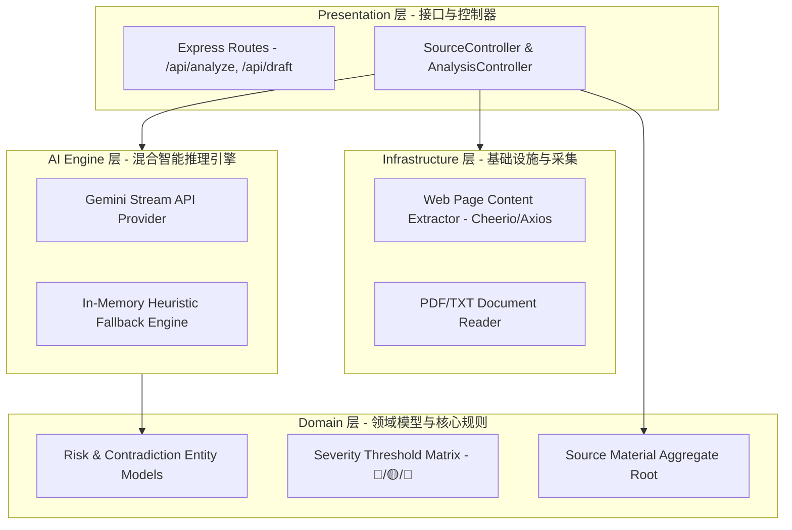
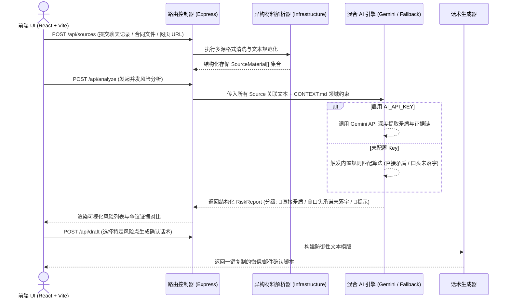
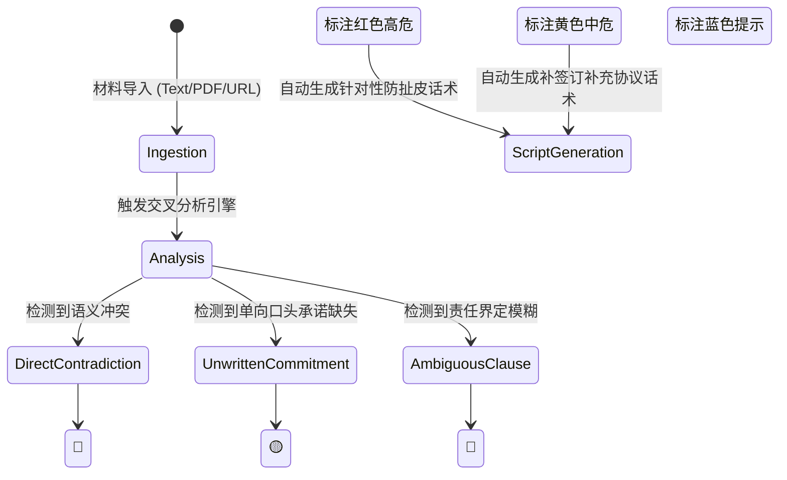

# 💬 有据 (YouJu) - AI 驱动的合同漏洞与聊天记录风险分析助手

[🇨🇳 中文](#-中文) | [🇺🇸 English](#-english)

---

## 🇨🇳 中文

### 📖 项目简介

**有据 (YouJu)** 是一款专注于**法律与商务交易风险预警**的 AI 智能分析系统。项目解决在二手交易、房屋租赁、外包合同签订及商务谈判中常见的“口头承诺不落地”、“合同条款与沟通记录矛盾”以及“隐蔽排他条款”等痛点。

系统通过多源材料协同比对引擎（支持粘贴聊天记录、上传 TXT/PDF 合同文本、抓取网页 URL），利用 **Gemini API** 结合自定义的领域专家 Prompt 约束规范，自动化扫描并甄别信息冲突与法律风险漏洞，同时一键生成具备法律防护效力的**防扯皮确认话术草稿**。

---

## 🛠️ 核心架构设计与工程实践 (Architecture & Design)

以下架构模块均在本项目中进行了完整的实现与落地，点击对应模块中的源码直链，即可查阅底层的核心代码实现细节：

### 1. 分层 DDD (Domain-Driven Design) 领域驱动架构 (Clean Architecture) 🏛️

*   **架构演进与思考**：后端采用严格的 Clean Architecture 分层架构，解耦业务领域模型（Domain）、AI 大模型推理引擎（AI Providers）、外部 Web 抓取/文件解析（Infrastructure）以及 HTTP 路由控制器（Presentation）。极大地提升了系统的单元测试覆盖率与 AI 模型更换弹力。
*   **分层架构流转图**：



*   **📂 核心源码直链**：
    - [youju-server/src/domain/ (核心领域风险实体与规则表)](youju-server/src/domain/)
    - [youju-server/src/ai/ (Gemini API 适配器与内置规则模拟引擎)](youju-server/src/ai/)
    - [youju-server/src/infrastructure/ (网页抓取与文件解析适配层)](youju-server/src/infrastructure/)
    - [youju-server/src/presentation/ (Express API 控制器及 DTO 参数校验)](youju-server/src/presentation/)

---

### 2. 多源异构材料比对与双引擎风险甄别流水线 (Multi-Source Ingestion & Dual AI Engine) 🔍

*   **设计思路**：支持多端异构文本协同分析。用户可同时输入合同样本与微信/钉钉聊天截图文本。系统首先在内存中对所有 Sources 进行清洗与词法拆解，随后送入双模态分析引擎：在提供 `AI_API_KEY` 时调用真实大模型；无 Key 时自动平滑降级至内置启发式规则引擎，保证系统离线可用性。
*   **时序原理图**：



*   **📂 核心源码直链**：
    - [youju-server/src/ai/ (Gemini 大模型 Prompt 交互与降级引擎)](youju-server/src/ai/)
    - [youju-server/src/app.ts (Express 应用全局路由与依赖注入中枢)](youju-server/src/app.ts)

---

### 3. 三级风险分类状态机与可视化展示 (Three-Tier Risk State Machine) 🔴🟡🔵

*   **设计思路**：将复杂的法律风险解构成三种直观等级，在 UI 侧以色彩标记并标注证据点来源（例如：聊天记录第 12 行 vs 合同条款第 4.2 条）：
    - 🔴 **直接矛盾 (Direct Contradiction)**：即正式合同条款与沟通承诺存在截然相反的表述。
    - 🟡 **承诺未落文字 (Unwritten Verbal Commitment)**：微信/口头答应了优惠或退款条件，但正式合同中完全缺失。
    - 🔵 **信息提示 (Informational Note)**：模棱两可的模糊用词（如“尽快”、“协商解决”）。



*   **📂 核心源码直链**：
    - [CONTEXT.md (系统领域术语表与 Prompt 知识库)](CONTEXT.md)
    - [PRD.md (详细产品功能定义与风险等级分类规范)](PRD.md)

---

## 📂 项目结构 (Project Structure)

```text
youju/
├── youju-app/              # React + Vite 前端客户端
│   ├── src/
│   │   ├── components/     # 材料输入、风险列表、话术对话生成组件
│   │   ├── hooks/          # 自定义 React Hooks (用以管理 Source 状态)
│   │   └── api/            # REST API Axios 客户端封装
│   └── package.json
├── youju-server/           # Express + TypeScript 领域后端服务
│   ├── src/
│   │   ├── ai/             # Gemini 大模型 Connector 与离线模拟引擎
│   │   ├── domain/         # 核心 Risk / Source 领域模型定义
│   │   ├── infrastructure/ # PDF/TXT 提取器与 URL 爬虫服务
│   │   ├── presentation/   # Express 路由控制器与 DTO
│   │   ├── app.ts          # Express 实例初始化
│   │   └── main.ts         # 服务启动入口
│   └── package.json
├── PRD.md                  # 产品需求说明书
└── CONTEXT.md              # 领域模型与 Prompt 上下文映射表
```

---

## 📊 技术栈选型 (Technology Stack)

| 层级 | 核心技术 | 作用 |
|:------|:-----------|:--------|
| **后端语言与架构**| Node.js + Express + TypeScript | Clean Architecture / DDD 架构后端服务 |
| **AI 大模型** | Google Gemini API (`gpt-3.5-turbo` / Gemini Connector) | 自动化漏洞扫描与确认话术推导 |
| **规则引擎降级** | Custom Heuristic Rule Engine | 离线 / 无 Key 状态下的启发式风险甄别 |
| **前端应用** | React 18 + Vite 5 + TypeScript | 响应式现代化 Web 前端 |
| **材料采集解析** | Cheerio + Axios + File Middleware | 网页抓取与多格式文档文本提取 |
| **样式与组件** | TailwindCSS + Lucide Icons | 高对比度可视化风险标注系统 |

---

## 🏃 快速启动指南

### 1. 启动后端服务
```bash
cd youju-server
npm install
npm run dev
```
后端服务默认运行在 `http://localhost:3001`。

### 2. 启动前端服务
```bash
cd youju-app
npm install
npm run dev
```
前端界面默认运行在 `http://localhost:5173`。

### 3. 配置 Gemini AI 密钥（可选）
编辑 `youju-server/.env` 文件：
```env
AI_API_KEY="your-gemini-or-openai-api-key"
AI_BASE_URL="https://api.openai.com/v1"
AI_MODEL="gpt-3.5-turbo"
```
未配置 Key 时，后端将自动降级使用内置规则引擎。

---

## 🌐 API 接口规范

| 方法 | HTTP 路径 | 功能说明 |
|:---|:---|:---|
| `POST` | `/api/sources/text` | 提交文本材料（如粘贴聊天记录） |
| `POST` | `/api/sources/upload` | 上传文档材料（TXT / PDF 合同文本） |
| `POST` | `/api/sources/url` | 自动抓取网页 URL 内容 |
| `GET` | `/api/sources` | 获取已收集材料列表 |
| `DELETE`| `/api/sources/:id` | 删除特定材料 |
| `POST` | `/api/analyze` | 触发交叉风险比对，生成 RiskReport |
| `POST` | `/api/draft` | 针对选定风险生成防扯皮微信/邮件确认话术 |
| `GET` | `/api/health` | 健康检查接口 |

---

## 🇺🇸 English

### 📖 Introduction

**YouJu (有据)** is an AI-powered legal & contract risk analysis system designed to safeguard commercial transactions, housing leases, and freelance contract negotiations.

By orchestrating heterogeneous multi-source ingestion (chat logs, uploaded TXT/PDF contract documents, scraped web URLs), YouJu leverages the **Gemini API** alongside context-constrained prompt pipelines to automatically identify loopholes, missing verbal promises, and contract contradictions—instantly generating actionable confirmation scripts for dispute resolution.

---

## 🛠️ Architecture Highlights

### 1. Clean / DDD Layered Architecture 🏛️
The backend enforces a strict Clean Architecture pattern separating domain entities (`domain/`), AI connectors and heuristic fallbacks (`ai/`), parsing infrastructure (`infrastructure/`), and HTTP controllers (`presentation/`).

### 2. Multi-Source Ingestion & Dual-Engine Fallback 🔍
Supports dual-mode processing: leverages real-time LLM inference when `AI_API_KEY` is provided, and gracefully degrades to an in-memory heuristic rule engine when offline.

---

## 📜 License

Licensed under the [MIT License](LICENSE).
