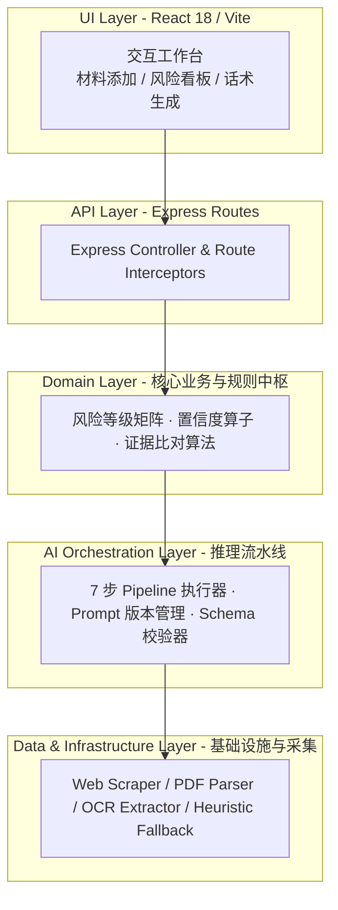
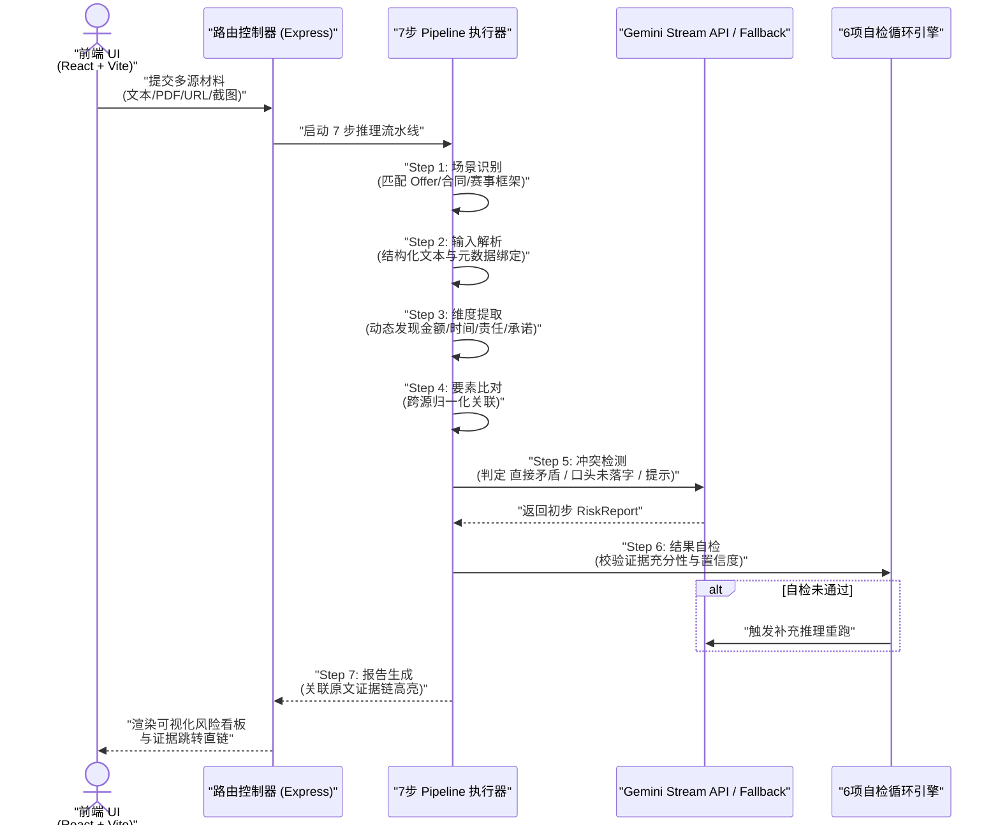
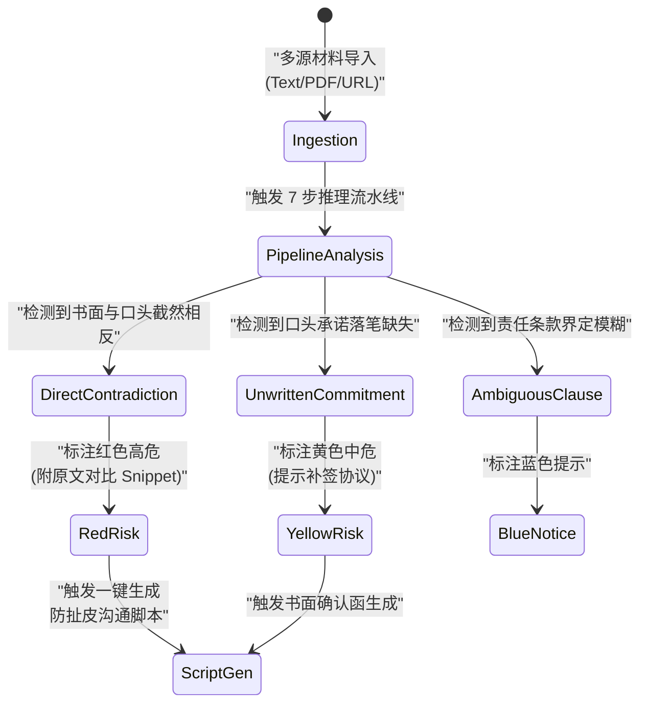

# 💬 有据 (YouJu) - AI 驱动的合同漏洞与聊天记录风险分析助手

<p align="center">
  [](https://youju-d0glz4mwbc5100a98-1316832532.tcloudbaseapp.com/)
  [](LICENSE)
  [](https://react.dev/)
</p>

<p align="center">
  <a href="README.md">🇨🇳 中文</a> &nbsp;|&nbsp; <a href="README_EN.md">🇺🇸 English</a>
</p>

---

<p align="center">
    <strong>AI 驱动的合同漏洞与聊天记录风险分析助手 · 5 层 DDD 解耦架构 · 7 步可追溯推理流水线</strong>
</p>

## 📖 项目起源与设计初衷 (Origin & Vision)

**有据 (YouJu)** 是一张数字化的"信息核对桌"与 AI 风险排雷工作台。项目的产生源于真实痛点：在求职 Offer 确认、房屋租赁、外包合同签订、比赛报名及商业采购等场景中，信息往往散落在 **微信聊天记录、正式合同 PDF、网页公示及邮件** 等多个地方。人的大脑无法同时记住所有版本并逐一比对，导致"口头说一套、落笔另一套"或"口头承诺无书面落字"的纠纷频发。

> **核心原则**：不替你做决定，只帮你在真正签字、付钱、提交前，把所有依据放回同一张桌上，让 AI 当那个"逐条对照、较真排雷的人"。

在 **TRAE AI 创造力大赛** 中，"有据"凭借创新的 5 层解耦架构与 7 步可追溯推理流水线，获得了广泛关注与认可。

🌐 **官方在线体验 Demo**：[https://youju-d0glz4mwbc5100a98-1316832532.tcloudbaseapp.com/](https://youju-d0glz4mwbc5100a98-1316832532.tcloudbaseapp.com/)

---

## 🛠️ 核心架构设计与工程实践 (Architecture & Design)

以下架构模块均在本项目中进行了完整的实现与落地，点击对应模块中的源码直链，即可查阅底层的核心代码实现细节：

### 1. 5 层解耦 Clean / DDD 领域驱动架构 (5-Layer Decoupled Architecture) 🏛️

*   **架构演进与思考**：摒弃传统"后端直接调大模型返回"的混杂模式，构建了 5 层严格隔离的架构。AI 仅负责"语义理解与表达"，业务逻辑判定（如风险等级划分、置信度折算）完全由 Domain 层接管。Prompt 仅管表达，所有 AI 输出均经过 Zod Schema 运行时校验，不合格则触发自动重试。
*   **5 层隔离拓扑图**：



*   **📂 核心源码直链**：
    - [youju-server/src/domain/ (核心领域风险实体、规则算子与 Schema 表)](youju-server/src/domain/)
    - [youju-server/src/ai/ (Gemini 大模型 Connector 与 7 步 Pipeline 编排器)](youju-server/src/ai/)
    - [youju-server/src/infrastructure/ (网页抓取与多格式文档提取器)](youju-server/src/infrastructure/)
    - [youju-server/src/presentation/ (Express API 控制器与 DTO 路由)](youju-server/src/presentation/)

---

### 2. 7 步透明推理流水线与自检自纠循环 (7-Step Transparent AI Pipeline) 🧠

*   **设计思路**：摒弃黑盒输出，将 AI 比对过程拆解为 7 个透明的步骤。引入**自检循环 (Self-Reflection Loop)**：AI 审视自身的推理结论，进行包括"证据充分性、分类准确性、严重程度合理性、确认偏误"在内的 6 项自检，确保结论能在原文找到准确证据。
*   **7 步流水线流程图**：



*   **7 步流水线定义**：
    1.  **场景识别**：自动识别材料类型（如 Offer / 租房合同 / 比赛通知），匹配最适配的分析维度。
    2.  **输入解析**：解析异构材料，提取清洗后的元数据。
    3.  **维度提取**：动态长出比对维度（金额 / 试用期 / 违约金 / 报销），而非预设死规则。
    4.  **要素提取**：跨源关联相同维度的具体表述并提取原文 Snippets。
    5.  **冲突检测**：精准甄别矛盾与缺失，附带置信度评分。
    6.  **结果校验**：执行 6 项自检循环，排除 AI 确认偏误。
    7.  **报告生成**：输出附带可点击溯源高亮证据链的结构化报告。

---

### 3. 红黄绿风险看板与沟通话术生成器 (Risk Dashboard & Actionable Script Generator) 🛡️

*   **三级风险分类看板**：
    - 🔴 **严重风险 (Direct Contradiction)**：口头承诺与正式合同条款直接相左（如微信说试用期全额，合同写打 8 折）。
    - 🟡 **待确认 (Unwritten Verbal Commitment)**：微信/口头答应的福利，正式合同中完全缺失。
    - 🔵 **信息提示 (Informational Note)**：模糊用词（如"视公司绩效而定"、"尽快付清"）。
*   **防扯皮沟通话术生成**：针对筛选出的特定风险点，AI 自动生成具备法律防护效力的沟通话术（支持**温和、正式、简洁**三种语气模式），直接复制发送至微信或邮件，促使对方回复以留下有效书面凭证。



*   **📂 核心源码直链**：
    - [CONTEXT.md (系统领域术语表与 Prompt 知识库)](CONTEXT.md)
    - [PRD.md (详细产品需求说明书与 26 项 User Story 规范)](PRD.md)

---

## 📂 项目结构 (Project Structure)

```text
youju/
├── youju-app/              # React + Vite 前端客户端
│   ├── src/
│   │   ├── components/     # 工作台、红黄绿风险看板、话术生成对话框
│   │   ├── hooks/          # 自定义 React Hooks (用以管理 Source 状态)
│   │   └── api/            # REST API Axios 客户端封装
│   └── package.json
├── youju-server/           # Express + TypeScript 领域后端服务
│   ├── src/
│   │   ├── ai/             # Gemini 7 步 Pipeline 编排器与离线模拟引擎
│   │   ├── domain/         # 核心 Risk / Source 领域模型与规则中枢
│   │   ├── infrastructure/ # PDF/TXT 提取器与 URL 爬虫服务
│   │   ├── presentation/   # Express 路由控制器与 DTO 校验
│   │   ├── app.ts          # Express 实例初始化
│   │   └── main.ts         # 服务启动入口
│   └── package.json
├── PRD.md                  # 产品需求说明书
└── CONTEXT.md              # 领域模型与 Prompt 上下文映射表
```

---

## 📊 技术栈选型 (Technology Stack)

| 层级 | 核心技术 | 作用 |
|:------|:-----------|:--------|
| **后端架构** | Node.js + Express + TypeScript | 5 层解耦 Clean / DDD 领域驱动后端 |
| **AI 大模型引擎** | Google Gemini API | 7 步 Pipeline 动态推演与话术生成 |
| **离线引擎降级** | Heuristic Rule Engine | 无 Key / 离线状态下的启发式规则判定 |
| **前端应用** | React 18 + Vite 5 + TypeScript | 高性能响应式数字工作台 |
| **多源材料解析** | Cheerio + Axios + File Middleware | 网页抓取与 PDF/TXT/Doc 文档文本抽取 |
| **UI 设计系统** | TailwindCSS + Lucide Icons | 高对比度风险看板与证据直链高亮 |

---

## 🏃 快速启动指南

### 1. 启动后端服务
```bash
cd youju-server
npm install
npm run dev
```
后端服务默认运行在 `http://localhost:3001`。

**预期输出**：
```bash
> youju-server@1.0.0 dev
> tsx watch src/main.ts
[Express] Server listening on port 3001
[Heuristic] Fallback engine ready (no AI key)
```

### 2. 启动前端服务
```bash
cd youju-app
npm install
npm run dev
```
前端界面默认运行在 `http://localhost:5173`。

**预期输出**：
```bash
VITE v5.x.x  ready in XXX ms
➜  Local:   http://localhost:5173/
```

### 3. 配置 Gemini AI 密钥（可选）
编辑 `youju-server/.env` 文件：
```env
AI_API_KEY="your-gemini-or-openai-api-key"
AI_BASE_URL="https://api.openai.com/v1"
AI_MODEL="gpt-3.5-turbo"
```
未配置 Key 时，后端将自动平滑降级使用内置规则引擎。

---

## 🌐 API 接口规范

| 方法 | HTTP 路径 | 功能说明 |
|:---|:---|:---|
| `POST` | `/api/sources/text` | 提交文本材料（如粘贴聊天记录） |
| `POST` | `/api/sources/upload` | 上传文档材料（TXT / PDF 合同文本） |
| `POST` | `/api/sources/url` | 自动抓取网页 URL 内容 |
| `GET` | `/api/sources` | 获取已收集材料列表 |
| `DELETE`| `/api/sources/:id` | 删除特定材料 |
| `POST` | `/api/analyze` | 触发 7 步推理流水线生成 RiskReport |
| `POST` | `/api/draft` | 针对选定风险生成防扯皮沟通话术 |
| `GET` | `/api/health` | 健康检查接口 |

---

## 🤝 参与贡献

欢迎贡献代码。简要流程：

```bash
# 1. Fork → Clone → 切分支
git checkout -b feat/your-feature

# 2. 后端构建通过
cd youju-server && npm run build

# 3. 前端构建通过
cd ../youju-app && npm run build

# 4. Commit 并提 PR
git commit -m "feat: your change"
git push origin feat/your-feature
```

**欢迎贡献的方向**：
- 🧩 新增材料解析器（Docx、图片 OCR、语音转写等）
- 🧪 补充 Domain 规则算子与端到端 E2E 测试
- 🌍 多语言国际化文案
- 🧹 修复 Issue 或优化 UI/UX

---

## 🔒 安全说明

| 风险场景 | 防护措施 |
|---------|---------|
| **AI API Key 泄露** | `.env` 已加入 `.gitignore`；仅服务端 `ai/connector.ts` 读取环境变量，从不打包进入前端 bundle |
| **上传材料隐私泄露** | 上传文件存储在临时目录，分析完成即删除；支持一键清空所有已提交材料 |
| **Zod Schema 注入穿透** | 所有 AI 输出在进入 Domain 层前强制经过 Zod 运行时校验，不合格则触发自动重试（上限 3 次） |
| **用户提交恶意文档** | File Middleware 限制上传文件大小与类型；服务端禁用 `eval` 与模板字符串渲染 |
| **Prompt 注入攻击** | 7 步 Pipeline 各阶段 System Prompt 与用户输入严格分离；Sanitizer 护栏截断越界输出 |

**漏洞上报**：发现安全问题请直接发邮件至 **`maox_neta@foxmail.com`**，不要公开在 Issue 里。承诺 **24 小时内首次响应**。

---

## 📜 许可证 (License)

基于 **MIT License** 开源协议。详见 [LICENSE](LICENSE) 文件。
