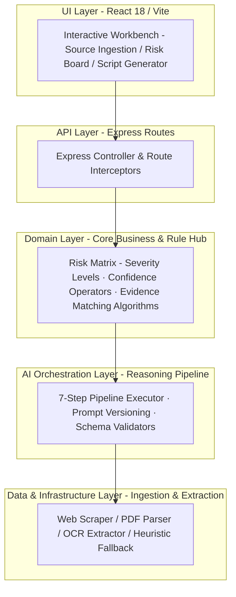
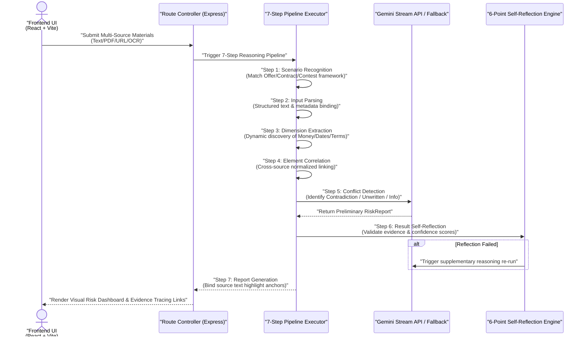
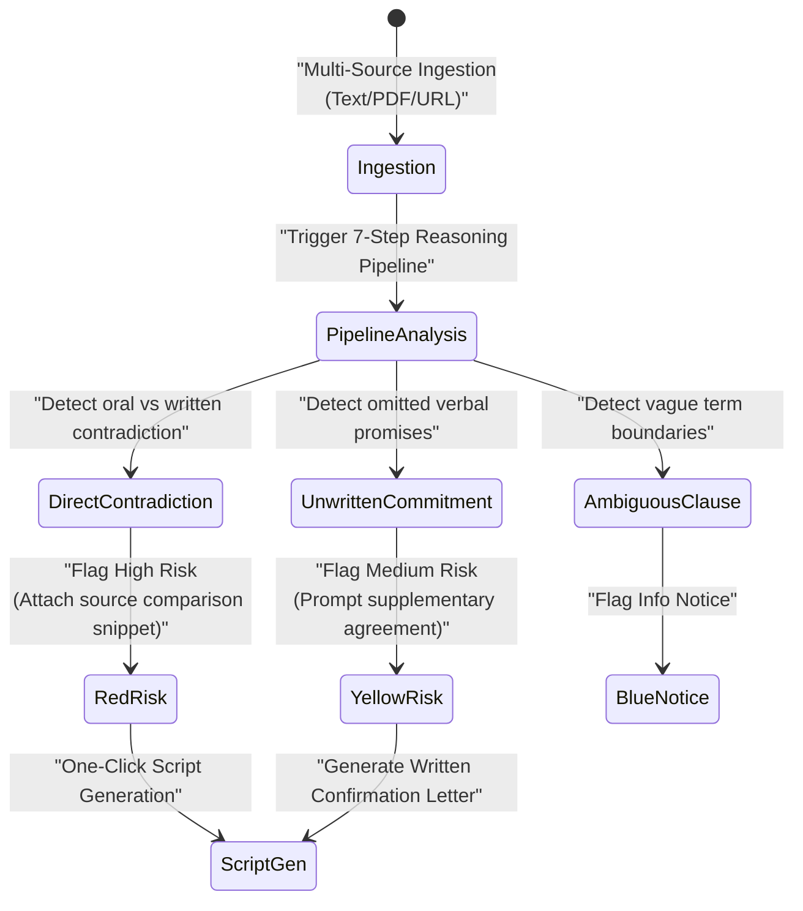

# 💬 YouJu (有据) - AI-Powered Contract Risk & Chat Discrepancy Analyzer

[](https://youju-d0glz4mwbc5100a98-1316832532.tcloudbaseapp.com/)
[](LICENSE)
[](https://react.dev/)

[🇨🇳 中文](README.md) | [🇺🇸 English](README_EN.md)

---

## 📖 Origin & Vision

**YouJu (有据)** is a digital risk inspection workbench and cross-verification system. It stems from a real-world pain point: during job offer confirmations, housing leases, freelance contract signings, competition applications, and commercial procurements, critical information is fragmented across **WeChat/Slack chat logs, formal PDF contracts, web announcements, and emails**. The human brain cannot simultaneously remember and line-by-line cross-examine multiple document versions, leading to frequent disputes where oral promises are omitted or contradicted in formal contracts.

> **Core Principle**: YouJu does not make decisions for you; it brings all supporting evidence back onto a single digital desk before you sign, pay, or submit, empowering AI to act as that "relentless, meticulous inspector."

Featured in the **TRAE AI Innovation Contest**, YouJu gained widespread acclaim for its innovative 5-Layer Decoupled Architecture and 7-Step Traceable Reasoning Pipeline.

🌐 **Live Demo Workbench**: [https://youju-d0glz4mwbc5100a98-1316832532.tcloudbaseapp.com/](https://youju-d0glz4mwbc5100a98-1316832532.tcloudbaseapp.com/)

---

## 🛠️ Architecture & Engineering Design

All architectural components below are fully implemented in this repository. Click any source code link to inspect the implementation details:

### 1. 5-Layer Decoupled Clean / DDD Architecture 🏛️

*   **Design Rationale**: Replaces the naive "backend calls LLM and returns raw text" pattern with a strict 5-layer isolated architecture. The AI engine is strictly responsible for "semantic understanding and natural expression," while business risk evaluation (severity thresholding, confidence score calculations) is fully governed by the Domain Layer. All AI outputs are validated at runtime via Zod Schemas; failed outputs automatically trigger self-reflection retry cycles.
*   **5-Layer Topology Diagram**:



*   **📂 Direct Source Code Links**:
    - [youju-server/src/domain/ (Core Domain Risk Entities, Rule Operators, & Schemas)](youju-server/src/domain/)
    - [youju-server/src/ai/ (Gemini LLM Connector & 7-Step Pipeline Orchestrator)](youju-server/src/ai/)
    - [youju-server/src/infrastructure/ (Web Scraper & Multi-Format Text Extractors)](youju-server/src/infrastructure/)
    - [youju-server/src/presentation/ (Express API Controllers & DTO Routes)](youju-server/src/presentation/)

---

### 2. 7-Step Transparent AI Reasoning Pipeline & Self-Reflection 🧠

*   **Design Rationale**: Replaces black-box generation with a transparent 7-step pipeline. Introduces a **Self-Reflection Loop**: the AI evaluates its own deductions against 6 verification criteria (evidence sufficiency, classification accuracy, severity rationality, confirmation bias check) to guarantee every risk point is grounded in original source quotes.
*   **7-Step Sequence Diagram**:



*   **7 Pipeline Steps Defined**:
    1.  **Scenario Recognition**: Automatically detects material type (Offer / Lease / Contest Rules) and applies domain-specific evaluation frameworks.
    2.  **Input Parsing**: Parses heterogeneous documents and cleans metadata.
    3.  **Dimension Extraction**: Dynamically identifies comparison axes (Salary / Probation / Penalties / Reimbursements) without rigid hardcoding.
    4.  **Element Correlation**: Links identical dimensions across sources and extracts exact source snippets.
    5.  **Conflict Detection**: Identifies contradictions and omissions with attached confidence scores.
    6.  **Self-Reflection**: Runs a 6-point self-review loop to eliminate hallucination and confirmation bias.
    7.  **Report Generation**: Outputs a structured report with clickable source text highlight anchors.

---

### 3. Red/Yellow/Green Risk Dashboard & Dispute Script Generator 🛡️

*   **Three-Tier Severity Classification**:
    - 🔴 **Severe Risk (Direct Contradiction)**: Oral commitment directly opposes formal contract terms (e.g., WeChat states full probation pay, but PDF contract slashes salary by 20%).
    - 🟡 **Pending Confirmation (Unwritten Verbal Commitment)**: Promised perks via chat/oral agreements are completely missing in the formal contract.
    - 🔵 **Informational Notice**: Ambiguous language requiring clarification (e.g., "Subject to company performance", "Pay as soon as possible").
*   **Actionable Dispute Communication Script Generator**: For selected risk points, AI generates polite, evidence-backed confirmation scripts (supporting **Gentle, Formal, Concise** tones) to copy directly into WeChat or Email, establishing written paper trails.



*   **📂 Direct Source Code Links**:
    - [CONTEXT.md (System Domain Glossary & Prompt Knowledge Base)](CONTEXT.md)
    - [PRD.md (Detailed Product Requirement Specification & 26 User Stories)](PRD.md)

---

## 📂 Project Structure

```text
youju/
├── youju-app/              # React + Vite Frontend Client
│   ├── src/
│   │   ├── components/     # Workbench, Red/Yellow/Green Dashboard, Script Modal
│   │   ├── hooks/          # Custom React Hooks (Source state management)
│   │   └── api/            # REST API Axios Client Wrapper
│   └── package.json
├── youju-server/           # Express + TypeScript Backend Service
│   ├── src/
│   │   ├── ai/             # Gemini 7-Step Pipeline Orchestrator & Heuristic Engine
│   │   ├── domain/         # Core Risk / Source Domain Models & Rule Hub
│   │   ├── infrastructure/ # PDF/TXT Extractors & Web Scraper Service
│   │   ├── presentation/   # Express Route Controllers & DTO Validation
│   │   ├── app.ts          # Express Instance Setup
│   │   └── main.ts         # Service Entry Point
│   └── package.json
├── PRD.md                  # Product Requirement Document
└── CONTEXT.md              # Domain Glossary & Prompt Mapping Table
```

---

## 📊 Technology Stack Matrix

| Layer | Core Technology | Role |
|:------|:-----------|:--------|
| **Backend Architecture** | Node.js + Express + TypeScript | 5-Layer Decoupled Clean / DDD Architecture |
| **AI LLM Engine** | Google Gemini API (`gpt-3.5-turbo` / Gemini Connector) | 7-Step Pipeline Reasoning & Script Generation |
| **Fallback Engine** | Heuristic Rule Engine | Offline / Keyless Heuristic Evaluation |
| **Frontend Application**| React 18 + Vite 5 + TypeScript | High-Performance Responsive Workbench |
| **Ingestion Engine** | Cheerio + Axios + File Middleware | Web Scraping & PDF/TXT/Doc Text Extraction |
| **UI Design System** | TailwindCSS + Lucide Icons | High-Contrast Risk Board & Evidence Tracing |

---

## 🏃 Quick Start Guide

### 1. Start Backend Service
```bash
cd youju-server
npm install
npm run dev
```
Backend defaults to `http://localhost:3001`.

**Expected output**:
```bash
> youju-server@1.0.0 dev
> tsx watch src/main.ts
[Express] Server listening on port 3001
[Heuristic] Fallback engine ready (no AI key)
```

### 2. Start Frontend App
```bash
cd youju-app
npm install
npm run dev
```
Frontend defaults to `http://localhost:5173`.

**Expected output**:
```bash
VITE v5.x.x  ready in XXX ms
➜  Local:   http://localhost:5173/
```

### 3. Configure Gemini AI Key (Optional)
Edit `youju-server/.env`:
```env
AI_API_KEY="your-gemini-or-openai-api-key"
AI_BASE_URL="https://api.openai.com/v1"
AI_MODEL="gpt-3.5-turbo"
```
If no key is configured, the backend automatically degrades to the built-in heuristic rule engine.

---

## 🌐 API Specification

| Method | HTTP Path | Description |
|:---|:---|:---|
| `POST` | `/api/sources/text` | Submit raw text material (e.g., pasted chat logs) |
| `POST` | `/api/sources/upload` | Upload document file (TXT / PDF contract) |
| `POST` | `/api/sources/url` | Scrape web page content from URL |
| `GET` | `/api/sources` | Fetch collected source materials list |
| `DELETE`| `/api/sources/:id` | Remove specific source material |
| `POST` | `/api/analyze` | Trigger 7-step reasoning pipeline & return RiskReport |
| `POST` | `/api/draft` | Generate actionable dispute communication script |
| `GET` | `/api/health` | Service health check endpoint |

---

## 🤝 Contributing

Contributions welcome. Quick flow:

```bash
# 1. Fork → Clone → Branch
git checkout -b feat/your-feature

# 2. Backend build passes
cd youju-server && npm run build

# 3. Frontend build passes
cd ../youju-app && npm run build

# 4. Commit and open a PR
git commit -m "feat: your change"
git push origin feat/your-feature
```

**Welcome contribution directions**:
- 🧩 Add new material parsers (Docx, image OCR, speech-to-text, etc.)
- 🧪 Add Domain rule operators and end-to-end E2E tests
- 🌍 Multi-language i18n localization
- 🧹 Fix issues or optimize UI/UX

---

## 🔒 Security

| Risk Scenario | Mitigation |
|---------|---------|
| **AI API Key Leak** | `.env` is in `.gitignore`; only server-side `ai/connector.ts` reads env vars; never bundled into frontend |
| **Uploaded Material Privacy Leak** | Uploaded files stored in temp directory; deleted after analysis; supports one-click clearing all submitted materials |
| **Zod Schema Injection Bypass** | All AI outputs force Zod runtime validation before entering Domain layer; failed ones trigger automatic retry (max 3) |
| **User Uploaded Malicious Documents** | File Middleware limits upload file size and type; server disables `eval` and template string rendering |
| **Prompt Injection Attack** | 7-Step Pipeline strictly separates System Prompts from user input at each stage; Sanitizer guardrail truncates out-of-bounds output |

**Vulnerability disclosure**: Report security issues directly to **`youju-security [at] googlegroups [dot] com`** — do not file a public issue. We commit to a **first response within 24 hours**.

---

## 📜 License

Licensed under the [MIT License](LICENSE).
